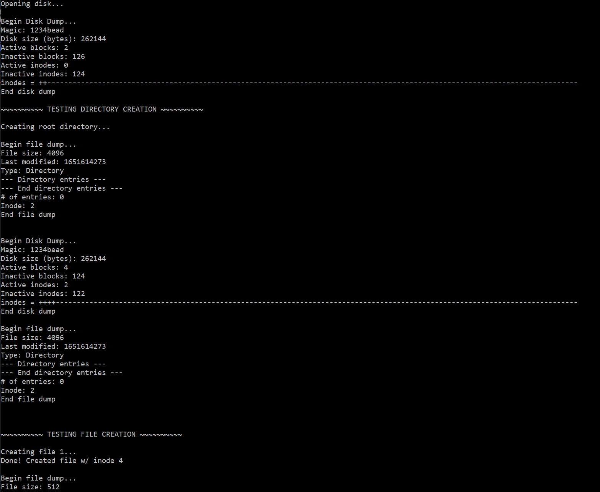

# File-System

This was a program I made in my operating system class. It emulates a file system by creating files and directories. It also supports reading and writing to a file as well as changing its size.
